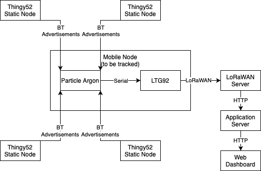
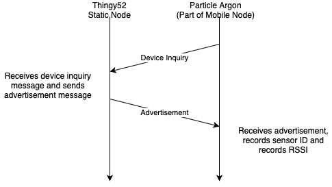

# Artemis-Blue

# Outdoor GPS Dead-Reckoning with Lorawan

## Team Members

| Name | Role |
| ----------- | ----------- |
| Rhys Sneddon |  |
| Mairah Zulkepli |  |

## Project Overview
### Project Description
The purpose of this project is to build an outdoor locating system using GPS and RSSI data in a dead reckoning system with kalman filtering. A static beacon network will be created using four thing:52s. The mobile node (consisting of a particle argon and LTG92) will send RSSI data from the static beacon network, along with GPS data from the LTG92's GPS module, over LoRaWAN to a LoRaWAN gateway. An application server will process the data to determine the mobile node's location using a dead-reckoning model with kalman filtering. Lastly, a web dashboard viewer will be used to show the current location of the mobile node. Scenarios that this project would be useful in include tracking animals, people or objects.

### Key Performance Indicator
The key performance indicators of the project would be:
1. Able to send gps location data, RSSI values and accelerometer data (longitude and latitude) from the mobile node to the LoRaWAN gps tracker
2. Having a web dashboard viewer showing the general location of the person
3. At least be able to track a person in a 10 x 10 m outdoor area
4. Able to send data from the LoRaWAN gps tracker to the LoRaWAN gateway
5. Dead-reckoning model with kalman filtering is used and is able to narrow down location of a person to increase accuracy

### System Overview
**Block Diagram**

### Sensor Integration

### Wireless Network Integration
**Bluetooth network**
To facilitate RSSI ranging, the Thingy52 static nodes transmit bluetooth advertisements with the following payload format:

| Byte | 0 | 1 |
| ----------- | ----------- | ----------- |
| Description | Preamble | Static Node ID |
| Value | 0b0011100 | e.g. 0x01 |

The Particle Argon scans for these advertisements as per the following message protocol diagram:

**LoRaWAN network**

GPS and RSSI and accelerometer data is sent to the LoRaWAN gateway via LoRaWAN as per the following payload formats and message protocol diagram:

**GPS and accelerometer data message payload (18 bytes)**

| Size (bytes) | 4 | 4 | 2 | 1 | 2 | 2 | 1 | 2 | 
| ----------- | ----------- | ----------- | ----------- | ----------- | ----------- | ----------- | ----------- | ----------- |
| Description | Latitude | Longitude | Alarm and battery | Flags | Roll | Pitch | HDOP | Altitude |

**RSSI data message payload (4 bytes)**

| Size (bytes) | 1 | 1 | 1 | 1 |
| ----------- | ----------- | ----------- | ----------- | ----------- |
| Description | RSSI of Static Node 1 | RSSI of Static Node 2 | RSSI of Static Node 3 | RSSI of Static Node 4 | 

### Algorithms
Dead-reckoning model with kalman filtering will be used to estimate the location of the mobile node. This is done by first having a known location of the node and then calculating an estimated location of the node by using the previous known location and the two rssi values received from the static nodes. In order to increase the accuracy of the estimated location, Kalman filter is then used.

### Equipment
- 1 x LGT92 LoRaWAN GPS Tracker
- 1 x Dragino Gateway
- 4 x Thingy:52
- 1 x Particle Argons

### Progress
- Received equipment
- Connected and tested serial interface to LTG92 LoRaWAN GPS Tracker 
- Researched more about dead-reckoning model
- Found tutorials on using the LoRaWAN GPS Tracker
