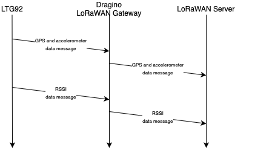

# Outdoor GPS Dead-Reckoning with Lorawan
# Artemis-Blue

## Team Members

| Name | Role |
| ----------- | ----------- |
| Rhys Sneddon | I will be working on the static node network, mobile node and LoRaWAN gateway. This will involve: bluetooth advertising with the static nodes; bluetooth scanning with the particle argon in the mobile node; serial communication between the particle argon and LTG92 in the mobile node (to transfer RSSI data); and sending GPS and RSSI data over LoRaWAN to the LoRaWAN gateway.|
| Mairah Zulkepli | I will be working on the dead reckoning model woth kalman filtering and pushing the data to the web dashboard. Once, the data from the LoRaWAN gateway is received, it will be passed through the dead reckoning model with kalman filter and then pushed to the web dashboard to display the current estimated location of the mobile node as well as the data received.|

## Project Overview/Scenario

### Project and Scenario Description
The purpose of this project is to perform outdoor locating of a mobile node using GPS and RSSI data in a dead reckoning system with kalman filtering. A static beacon network will be created using four thing:52s. The mobile node (consisting of a particle argon and LTG92) will send RSSI data from the static beacon network, along with GPS data from the LTG92's GPS module, over LoRaWAN to a LoRaWAN gateway. An application server will process the data to determine the mobile node's location using a dead-reckoning model with kalman filtering. Lastly, a web dashboard viewer will be used to show the current location of the mobile node. Scenarios that this project would be useful in include tracking of animals, people or objects.

### System Overview
**System Block Diagram**

**Software Flow Chart**

### Sensor Integration
The L76-L GPS sensor will be used to get longitude and latitude data for the mobile node. It will be accessed through I2C using the firmware on the LTG92. 

### Wireless Network Communications
#### Bluetooth network 
To facilitate RSSI ranging, the Thingy52 static nodes transmit bluetooth advertisements with the following payload format:

| Byte | 0 | 1 |
| ----------- | ----------- | ----------- |
| Description | Preamble | Static Node ID |
| Value | 0b0011100 | e.g. 0x01 |

The Particle Argon scans for these advertisements as per the following message protocol diagram:

The bluetooth network is arranged in a star topology with all of the static nodes communicating with the one mobile node. An extremely low data rate is required.

#### LoRaWAN network 

GPS and RSSI and accelerometer data is sent to the LoRaWAN gateway via LoRaWAN as per the following payload formats and message protocol diagram:

**GPS and accelerometer data message payload (18 bytes)**

| Size (bytes) | 4 | 4 | 2 | 1 | 2 | 2 | 1 | 2 | 
| ----------- | ----------- | ----------- | ----------- | ----------- | ----------- | ----------- | ----------- | ----------- |
| Description | Latitude | Longitude | Alarm and battery | Flags | Roll | Pitch | HDOP | Altitude |

**RSSI data message payload (4 bytes)**

| Size (bytes) | 1 | 1 | 1 | 1 |
| ----------- | ----------- | ----------- | ----------- | ----------- |
| Description | RSSI of Static Node 1 | RSSI of Static Node 2 | RSSI of Static Node 3 | RSSI of Static Node 4 | 

The LoRaWAN network is arranged in point-to-point topology (LGT92 to Dragino LoRaWAN gateway). An extremely low data rate is required.

### Algorithm Schemes
Dead-reckoning model with kalman filtering will be used to estimate the location of the mobile node. This is done by first having a known location of the node and then calculating an estimated location of the node by using the previous known location and the two rssi values received from the static nodes. In order to increase the accuracy of the estimated location, Kalman filter is then used.

### Key Performance Indicators
The key performance indicators of the project would be:
1. Particle argon able to determine RSSI values for the static nodes and send them to the LTG92
2. Able to send data GPS and RSSI data from the LTG92 LoRaWAN GPS tracker to the LoRaWAN gateway
3. Data is processed using a dead-reckoning model with kalman filtering to determine the location of the mobile node with maximal accuracy
4. Having a web dashboard viewer that shows the determined location of the mobile node
5. Be able to usefully track the mobile node in at least a 100 x 100 m outdoor area

### Equipment
- 1 x LGT92 LoRaWAN GPS Tracker
- 1 x Dragino Gateway
- 4 x Thingy:52
- 1 x Particle Argon

### Progress
- Received equipment
- Connected and tested serial interface to LTG92 LoRaWAN GPS Tracker 
- Researched more about dead-reckoning model
- Found tutorials on using the LoRaWAN GPS Tracker